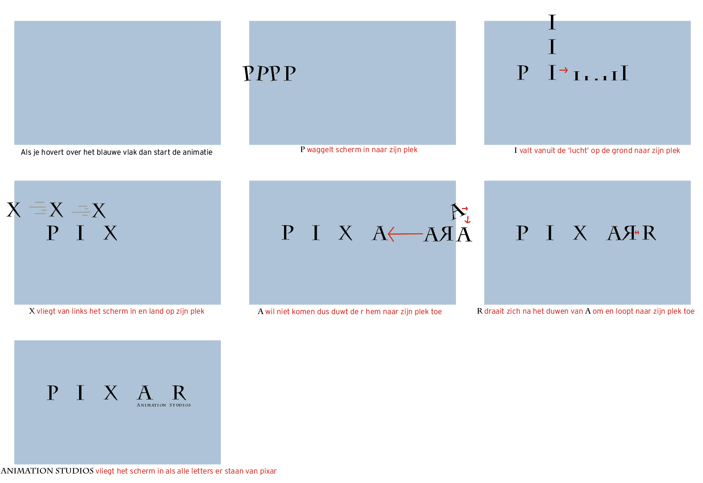

# Procesverslag
**Auteur:** -Juliette Groot-

**De opdrachten:** [opdracht 1](opdracht1/index.html) en [opdracht 2](opdracht2/index.html)

Markdown is een simpele manier om HTML te schrijven.  
Markdown cheat cheet: [Hulp bij het schrijven van Markdown](https://github.com/adam-p/markdown-here/wiki/Markdown-Cheatsheet).

Nb. De standaardstructuur en de spartaanse opmaak van de README.md zijn helemaal prima. Het gaat om de inhoud van je procesverslag. Besteedt de tijd voor pracht en praal aan je website.

Nb. Door *open* toe te voegen aan een *details* element kun je deze standaard open zetten. Fijn om dat steeds voor de relevante stuk(ken) te doen.

## Bronnenlijst
  1. -bron 1-
  2. -bron 2-
  3. -...-

## Opdracht 1 plan

  
uitwerken na schetsen idee (voor week 2)

  Mij leek het leuk om de logo van pixar te gaan animeren. Ik heb deze keuze gemaakt omdat er een hele bekende animatie is bij dit logo en het leek mij leuk om er mijn eigen draai aan te geven. In het storyboard dat je hieronder kan zien, laat ik zien wat voor animaties ik wil doen per letter en hoe dat er dan uitziet.

  #### Week 1:
  Ik ben van plan om in week 2 te starten aan het coderen van de animaties om te zien of ik ergens tegen aan ga lopen of niet en zodat ik genoeg tijd heb om vragen te stellen als dat nodig is.

  #### Week 2:
  Ik heb er deze week voor gekozen om niet mijn storyboard te volgen omdat ik doorheb dat mijn storyboard iets te lastig gaat zijn om waar te maken. Ik heb ervoor gekozen om alleen de lamp animatie van de originele PIXAR animatie na te maken. Ik moet hier nog een storyboard van maken.
  

  #### Week 3:
  Deze week wil ik de opzet maken van mijn html en wil ik ervoor zorgen dar de css er een beetje oke uit ziet zodat ik in week 4 kan starten aan het animeren.

  #### Week 4:
  Ik wil deze week een start maken aan de animaties. Ik wil starten met dat de lamp het scherm in springt en op zijn plek(boven de i) stil komt te staan. Ik snap alleen niet helemaal hoe ik ervoor moet zorgen dat de lamp en springt en van plek verandert tegelijkertijd dus dat moet ik even vragen.

  #### Week 5:
 Met een beetje hulp is het gelukt om de lamp het scherm in te laten springen en te laten stoppen op de goeie plek. Deze week wil ik ervoor zorgen dat 'animation studios' het scherm in vliegt wanneer de animatie voorbij is. Daarnaast wil ik de laatste animaties van de lamp maken en ervoor zorgen dat I mee animeert op de goeie momenten. Tijdens de les van deze week gaan we elkaar beoordelen dus daarvoor moet het wel werken.

  ### Je storyboard:
  
  Dit is het storyboard die ik heb gemaakt in week 1. Hierin laat ik zien wat voor animaties ik elke letter wil laten doen.

  ### Je ambitie: 
  Aan deze technieken/punten wil ik werken:
  - Ik merkte tijdens de eertse les in week 1 dat ik niet zo heel veel had onthouden van animeren dus ik wil er vooral sneller in worden en er meer van gaan begrijpen.
  - Ik hoop dat ik mijn ideeën kan waar maken zoals ik ze in mijn hoofd voor me zie.
 

## Opdracht 1 reflectie

  ### Je uitkomst - karakteristiek screenshot(s):
  
  Dit is hoe mijn logo eruit ziet als de animatie klaar is.

  ### Dit ging goed/Heb ik geleerd: 
  Korte omschrijving met plaatje(s)

  

  ### Dit was lastig/Is niet gelukt:
  Korte omschrijving met plaatje(s)

  

  ### Reflectie per week
  Hier ga ik kort een reflectie doen op elke week tot de beoordeling op elkaar.

  #### Week 1:
  Deze week heb ik best wel veel gedaan. Ik heb mijn logo gekozen en ook een storyboard gemaakt van de animaties die ik wilde doen op elke letter. Ik vind dat deze week best goed ging en had veel zin om te starten met het coderen en animeren.

  #### Week 2:
  Deze week heb ik minder gedaan dan ik wilde. Ik kwam er wel snel achter dat mijn eerste idee en storyboard een beetje vergezocht was in de korte tijd die we kregen en in mijn ervaring met animeren. Dit was een goede keuze! Ik had het al lastig genoeg met de kleine lamp animatie die ik uiteindelijk heb gedaan. Ik wilde ook deze week een nieuwe storyboard maken, maar dat had ik uiteindelijk niet gedaan wat niet heel handig is.

  #### Week 3:
  Deze week heb ik een aantal stappen gemaakt met mijn code. Ik ben tevreden met de code die ik geschreven heb, maar achteraf had ik deze week weil iets meer tijd kunnen besteden aan de css en opmaak zodat ik dit niet later nog moest doen.

  #### Week 4:
  Deze week begonnen de wielen pas echt te draaien. Ik ben blij dat ik om hulp vroeg deze week omdat ik heel erg vast liep en er zelf totaal niet uitkwam. Door de hulp heb ik wel een stuk meer kunnen doen en werkt het eerste deel van mijn animatie ook echt!

  #### Week 5:
  Deze week gingen we elkaar beoordelen en ik was echt niet ver genoeg hiervoor. Wat niet heel handig was van mijzelf. Hierdoor ging ik de beoordeling in met een halve animatie. Na de beoordeling met Jinke(wij hebben elkaar beoordeeld), heeft zij mij een beetje geholpen. Mijn probleem was namelijk dat ik niet wist hoe ik meerdere animaties achter elkaar werkend moest krijgen en toen heeft zij mij hierbij geholpen. Dit was erg fijn omdat ik echt geen idee had hoe ik dit moest oplossen. Ik had al heel veel online gezocht naar het antwoord maar ik kreeg hem maar niet. Toen kwam ik er door haar achter dat ik met webkit mijn probleem op kon lossen wat top was! Ik was deze week nog niet helemaal klaar met mijn animatie, maar ik moet alleen maar de puntjes op de I zetten.

  ### Overview reflectie:  
  Door bovenstaande te lezen kan ik wel uitmaken dat ik iets te laat ben begonnen met wat belangrijk was, namelijk de animatie zelf. Als ik het allemaal opnieuw zou moeten dan zou ik het zeker niet weer zo aanpakken. Ik zou dan sowieso eerder om hulp vragen want nu bleef ik heel erg hangen waardoor ik niks meer deed. Daarnaast zou ik dan ook een stuk eerder starten. Voor de rest ging deze opdracht wel prima!

## Opdracht 2 plan

  
uitwerken na schetsen idee (voor week 4)

  ### Je ontwerp:
  

  ### Je ambitie: 
  Aan deze technieken/punten wil ik werken:
  - punt 1
  - punt 2
  - nog een punt
  - ...

## Opdracht 2 test

  
uitwerken na testen (week 6/7)

  Neem minimaal 5 bevindingen op:

  ### Bevinding 1:
  Omschrijving van wat er nog niet orde was (tekst en afbeeding(en)).

  #### oplossing:
  Beschrijving hoe je het hebt hebt opgelost of als het niet gelukt is hoe je het zou oplossen (tekst en afbeeding(en)).

  ### Bevinding 2:
  Omschrijving van wat er nog niet orde was (tekst en afbeeding(en)).

  #### oplossing:
  Beschrijving hoe je het hebt hebt opgelost of als het niet gelukt is hoe je het zou oplossen (tekst en afbeeding(en)).

  ### Bevinding 3:
  ...

## Opdracht 2 reflectie

  
uitwerken bij afronden opdracht (voor week 8)

  ### Je uitkomst - karakteristiek screenshot(s):
  

  ### Dit ging goed/Heb ik geleerd: 
  Korte omschrijving met plaatje(s)

  

  ### Dit was lastig/Is niet gelukt:
  Korte omschrijving met plaatje(s)

  

